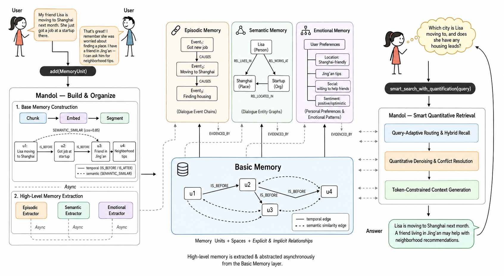

# Mandol

> Mandol: An In-Memory Agent Memory System

[](LICENSE)
[](https://www.python.org/)
[](https://github.com/AgentCombo/Mandol/actions/workflows/ci.yml)
[](https://pypi.org/project/mandol/)
[](https://pypi.org/project/mandol/)
[](https://agentcombo.github.io/Mandol)
[](https://agentcombo.github.io/Mandol/docs)
[](https://arxiv.org/abs/2606.29778)

[English](README.md) | [中文](README_CN.md)

> [!IMPORTANT]
> The `main` branch now contains the current public Mandol Python
> implementation. The pre-migration implementation previously hosted on
> `main` is preserved in
> [`legacy/original`](https://github.com/AgentCombo/Mandol/tree/legacy/original)
> for historical reference.
>
> The results reported in the paper were produced with the frozen
> [`paper-repro`](https://github.com/AgentCombo/Mandol/tree/paper-repro)
> artifact. Use `paper-repro` when exact reproduction of the reported
> experiments is required.



---

## 📑 Table of Contents

<details>
<summary><b>Show/Hide</b></summary>

- [📖 What is Mandol?](#-what-is-mandol)
- [💡 Core Modules and Techniques](#-core-modules-and-techniques)
- [✨ Implementation](#-implementation)
- [🔬 Reproduction](#-reproduction)
- [⚡ Quick Start](#-quick-start)
- [📚 Documentation & Community](#-documentation--community)
- [📄 Citation](#-citation)
- [📄 License](#-license)

</details>

---

## 📖 What is Mandol?

Mandol is a native in-memory hierarchical memory system for LLM agents such as long-term conversational agents. Its core components are:

1. **Hierarchical Memory Model** — Organizes memory into a basic layer and a high-level abstract layer, both uniformly represented as a structured semantic graph with traceable relationships between all memory elements.
2. **In-Memory Semantic Data Structures** — Combines *SemanticMap* and *SemanticGraph* to natively fuse key-value, vector, and graph stores into a unified hybrid retrieval interface, eliminating cross-database I/O overhead.
3. **Smart Quantitative Retrieval** — A query-adaptive routing mechanism with two-stage denoising, conflict resolution, and token-constrained context generation — all operating without invoking LLMs during retrieval.

On the LoCoMo and LongMemEval long-term conversation benchmarks, Mandol achieves state-of-the-art accuracy of 92.21% and 88.40%, respectively. Compared to representative agent memory systems, Mandol delivers a 5.4× retrieval speedup and a 4.8× insertion speedup under 10 QPS concurrent load, while sustaining low latency on consumer-grade hardware. These results validate the system's effectiveness, efficiency, and stability in complex long-conversation scenarios.

**System-level comparison of agent memory systems:**

| System | Memory Organization | Storage | Retrieval | Search Latency |
|--------|---------------------|---------|-----------|----------------|
| Mem0 | Text vectors + metadata | VectorDB + metadata store | Vector semantic retrieval + metadata filtering | Medium |
| Zep | Text vectors + temporal knowledge graph | GraphDB + vector/full-text indexes | Multi-step graph traversal + reranking | High |
| MemOS | Text vectors + graph/tree summaries | VectorDB + GraphDB | Vector retrieval + graph node matching | High |
| EverMemOS | Text vectors + memory summaries | Multi-DB stack | Multi-turn retrieval + query rewriting | Very high |
| Mandol | Basic + high-level memories represented as a structured semantic graph | SemanticMap/Graph with RocksDB-backed tiered payload paging | Hybrid recall + smart quantitative retrieval | Low |

**LoCoMo accuracy (%) comparison among different memory systems:**

<table>
<thead>
<tr>
<th>Backbone</th>
<th>System</th>
<th>Avg. Tok.</th>
<th>Single</th>
<th>Multi</th>
<th>Temp.</th>
<th>Open</th>
<th>Overall</th>
</tr>
</thead>
<tbody>
<tr>
<td rowspan="6"><i>GPT-4o-mini</i></td>
<td>Mem0</td><td>1.0k</td><td>66.71</td><td>58.16</td><td>55.45</td><td>40.62</td><td>61.00</td>
</tr>
<tr>
<td>MemU</td><td>4.0k</td><td>72.77</td><td>62.41</td><td>33.96</td><td>46.88</td><td>61.15</td>
</tr>
<tr>
<td>MemOS</td><td>2.5k</td><td>81.45</td><td>69.15</td><td>72.27</td><td>60.42</td><td>75.87</td>
</tr>
<tr>
<td>Zep</td><td>1.4k</td><td>88.11</td><td>71.99</td><td>74.45</td><td>66.67</td><td>81.06</td>
</tr>
<tr>
<td>EverMemOS<sup>†</sup></td><td>2.5k</td><td><u>91.68</u></td><td><u>82.74</u></td><td><u>79.34</u></td><td><strong>70.14</strong></td><td><u>86.13</u></td>
</tr>
<tr>
<td>Mandol (Ours)</td><td>2.0k</td><td><strong>93.82</strong></td><td><strong>85.11</strong></td><td><strong>89.10</strong></td><td>65.63</td><td><strong>89.48</strong></td>
</tr>
<tr>
<td rowspan="6"><i>GPT-4.1-mini</i></td>
<td>Mem0</td><td>1.0k</td><td>68.97</td><td>61.70</td><td>58.26</td><td>50.00</td><td>64.20</td>
</tr>
<tr>
<td>MemU</td><td>4.0k</td><td>74.91</td><td>72.34</td><td>43.61</td><td>54.17</td><td>66.67</td>
</tr>
<tr>
<td>MemOS</td><td>2.5k</td><td>85.37</td><td>79.43</td><td>75.08</td><td>64.58</td><td>80.76</td>
</tr>
<tr>
<td>Zep</td><td>1.4k</td><td>90.84</td><td>81.91</td><td>77.26</td><td>75.00</td><td>85.22</td>
</tr>
<tr>
<td>EverMemOS<sup>†</sup></td><td>2.3k</td><td><u>95.32</u></td><td><u>89.01</u></td><td><strong>90.13</strong></td><td><u>77.43</u></td><td><u>91.97</u></td>
</tr>
<tr>
<td>Mandol (Ours)</td><td>1.9k</td><td><strong>95.36</strong></td><td><strong>92.20</strong></td><td>87.85</td><td><strong>79.17</strong></td><td><strong>92.21</strong></td>
</tr>
</tbody>
</table>

> <sup>†</sup> Reproduced using the official implementation from EverMemOS.

Mandol achieves the highest Overall accuracy on LoCoMo under both backbone settings.

**LongMemEval accuracy (%) comparison among different memory systems:**

<table>
<thead>
<tr>
<th>Backbone</th>
<th>System</th>
<th>Avg. Tok.</th>
<th>SS-Pref</th>
<th>SS-Asst</th>
<th>Temporal</th>
<th>Multi-S</th>
<th>Know. Upd.</th>
<th>SS-User</th>
<th>Overall</th>
</tr>
</thead>
<tbody>
<tr>
<td rowspan="5"><i>GPT-4o-mini</i></td>
<td>MemU</td><td>0.5k</td><td>76.70</td><td>19.60</td><td>17.30</td><td>42.10</td><td>41.00</td><td>67.10</td><td>38.40</td>
</tr>
<tr>
<td>Mem0</td><td>1.1k</td><td><u>90.00</u></td><td>26.78</td><td>72.18</td><td>63.15</td><td>66.67</td><td>82.86</td><td>66.40</td>
</tr>
<tr>
<td>Zep</td><td>1.6k</td><td>53.30</td><td><u>75.00</u></td><td>54.10</td><td>47.40</td><td><u>74.40</u></td><td>92.90</td><td>63.80</td>
</tr>
<tr>
<td>MemOS</td><td>1.4k</td><td><strong>96.67</strong></td><td>67.86</td><td><u>77.44</u></td><td><u>70.67</u></td><td>74.26</td><td><u>95.71</u></td><td><u>77.80</u></td>
</tr>
<tr>
<td>Mandol (Ours)</td><td>2.1k</td><td><strong>96.67</strong></td><td><strong>98.21</strong></td><td><strong>78.95</strong></td><td><strong>74.44</strong></td><td><strong>88.46</strong></td><td><strong>97.14</strong></td><td><strong>85.00</strong></td>
</tr>
<tr>
<td rowspan="2"><i>GPT-4.1-mini</i></td>
<td>EverMemOS</td><td>2.8k</td><td><u>93.33</u></td><td><u>85.71</u></td><td><u>77.44</u></td><td><u>73.68</u></td><td><strong>89.74</strong></td><td><u>97.14</u></td><td><u>83.00</u></td>
</tr>
<tr>
<td>Mandol (Ours)</td><td>2.3k</td><td><strong>96.67</strong></td><td><strong>98.21</strong></td><td><strong>87.22</strong></td><td><strong>77.44</strong></td><td><strong>89.74</strong></td><td><strong>98.57</strong></td><td><strong>88.40</strong></td>
</tr>
</tbody>
</table>

Mandol achieves the highest Overall accuracy on LongMemEval under both backbone settings.

**Evaluation methodology.** Retrieval quality is measured via QA accuracy on the two benchmarks, defined as the percentage of questions whose generated answers are judged correct or semantically consistent with the ground-truth answers. Following the evaluation protocol of prior memory-system studies, GPT-4o-mini and GPT-4.1-mini serve as the answer-generation backbones, and we adopt the released LLM-based answer correctness evaluation script from EverMemOS.<br/>
Notably, rather than using large-parameter models such as Qwen3-Embedding-4B and Qwen3-Reranker-4B, we employ lightweight alternatives — Qwen3-Embedding-0.6B for embedding and bge-reranker-v2-m3 for reranking.


---

## 💡 Core Modules and Techniques

### (I) Hierarchical Memory Model

Memory is organized into a basic memory layer and a high-level abstract memory layer, both uniformly represented as a structured semantic graph.
The basic layer represents raw memory through memory units, spaces, and explicit/implicit relationships.
The abstract layer models episodic memory (event chains), semantic memory
(entity graphs), and emotional memory (user preferences), with traceable links
that support evidence grounding and abstract reasoning. In the current public
implementation, `mandol.auto_builder` exposes explicit workflows for
hierarchical summaries, episodic facts, and entity-relation structures.


### (II) In-Memory Semantic Data Structures

*SemanticMap* and *SemanticGraph* form a unified in-process data structure that combines memory-unit access, vector and sparse indexes, MemorySpace membership, and graph topology. Hybrid retrieval operators combine vector matching and graph traversal through one API surface. For larger memory collections, RocksDB-backed tiered paging can move cold `MemoryUnit` payloads out of the resident cache while keeping retrieval indexes and graph state in memory.


### (III) Smart Quantitative Retrieval Mechanism

The RAG-style recall-then-rank paradigm is replaced with a proactive pipeline of Query-Adaptive Routing, two-stage denoising and conflict resolution, and token-constrained context generation. Query-Adaptive Routing dynamically selects and queries the most relevant memory sources based on query intent. Two-stage quantitative denoising and conflict resolution then remove noise and contradictory information across sources. Finally, a compact high-quality context is assembled under token constraints by jointly optimizing relevance and diversity — all without LLM involvement in retrieval.


---

## ✨ Implementation
The maintained package is organized around `core` data structures,
`retrieval` and `triple_retrieval` pipelines, `auto_builder` high-level memory
construction, `memory_router` and `quantification` policies, and the `storage`
tiered-paging layer.

**Core APIs exposed by Mandol:**

| Scope | API |
|-------|-----|
| Memory units | `SemanticGraph.add_unit()` / `batch_add_units()` / `delete_unit()` |
| Explicit relationships | `SemanticGraph.add_relationship()` / `delete_relationship()` |
| Dense graph search | `SemanticGraph.search_similarity_in_graph()` |
| Multi-method retrieval | `MultiRetriever.smart_search()` |
| Three-tower retrieval | `TripleTowerRetriever.search()` / `smart_search()` |
| Retrieval sufficiency | `SemanticQuantifier` |
| Persistence | `SemanticGraph.save_graph()` / `load_graph()` / `connect_to_l2()` |
| High-level construction | `MemoryOrchestrator` / `build_high_level_memory()` |

### Memory Construction and Storage

`SemanticGraph.add_unit()` and `batch_add_units()` insert base `MemoryUnit` objects and update the configured dense and sparse indexes. High-level construction is an explicit workflow provided by `mandol.auto_builder`; its orchestrator and builders can derive hierarchical summaries, episodic facts, and entity-relation structures while retaining links to the base memories.

### Memory Retrieval

Applications can use `SemanticGraph.search_similarity_in_graph()` for direct dense retrieval, `MultiRetriever.smart_search()` for fused BM25/SPLADE/cosine retrieval, or `TripleTowerRetriever` for the paper's hierarchical, graph, and episodic retrieval paths. Router and quantification components compose these paths for the benchmark workflows; they are separate from base unit insertion and indexing.

### Memory Persistence
By default, payloads remain resident in `SemanticMap`, and `SemanticGraph.save_graph()` / `load_graph()` provide complete local snapshots. RocksDB is the only supported persistent payload backend in the current implementation. Calling `connect_to_l2()` enables automatic tiered paging: dense, BM25, and SPLADE indexes, UID mappings, MemorySpace membership, and graph topology remain resident, while cold payloads are evicted asynchronously after the high watermark is reached and paged back into the resident cache when a retrieval result requires them.

---

<!-- ## 📊 Comparison with Mainstream Memory Systems

The fundamental distinction between Mandol and existing memory systems lies in the retrieval paradigm: traditional systems treat retrieval as a unidirectional pipeline (embedding recall → rerank → top-K), where the process is passive and lacks explicit noise control. Mandol restructures this into a three-stage proactive retrieval pipeline — dynamically routing to the most relevant memory sources based on query intent, performing multi-level quantitative filtering and conflict resolution within and across sources, and finally generating high-information-density context under token constraints. This paradigm upgrade transforms retrieval from passive "match–return" to proactive "understand–filter–summarize."

At the architectural level, Mandol keeps retrieval indexes and graph topology in process and optionally uses RocksDB for automatic cold-payload paging. This public implementation does not expose a general-purpose storage-backend switching contract.

> For detailed benchmark comparison data, see the performance table in the [What is Mandol?](#-what-is-mandol) section above.

--- -->
<!-- 
## 🏆 Application Cases

### Long Conversational Memory Benchmark: LoCoMo

On the LoCoMo benchmark (10 long-term conversations × 200+ turns, covering single-hop / multi-hop / temporal / open-domain queries), Mandol achieves the highest **multi-hop reasoning** score (92.20) among all systems. This is attributed to `SemanticGraph`'s explicit entity-relation graph and BFS graph expansion mechanism, which traverses along relational edges across multiple hops to discover indirectly connected evidence.

> When queried "How did Manager Zhang's decision last year affect the Q2 project delay this year?", Mandol traces along the event causal chain `Decision A → Team restructuring → Resource transfer → Project B delay → Q2 delivery postponed`, completing a 4-hop trace. In contrast, pure vector retrieval can only return isolated fragments containing keywords like "Manager Zhang" or "Q2."

### Long Memory Evaluation Benchmark: LongMemEval

LongMemEval emphasizes memory retention and knowledge update capabilities in multi-session scenarios. Mandol achieves near-perfect scores on assistant-side memory (SS-Asst 98.21) and user-side memory (SS-User 98.57), with a knowledge update score of 89.74 — when two versions of the same fact exist (old and new), the system accurately adopts the new information and resolves the conflict, validating the effectiveness of cross-session coreference resolution and the "prefer new information" strategy.

### Intelligent Customer Service

In multi-turn customer service dialogues, when a user asks "What can I do about the price drop on the blue shirt I bought yesterday?", the system must simultaneously correlate memories across three dimensions: **temporal events** (when the price drop occurred), **product attributes** (blue shirt SKU), and **user information** (purchase records, membership tier). Mandol directly pinpoints the specific order and applicable price protection policy through multi-dimensional associative queries, generating an accurate response such as "Your order qualifies for our price protection policy. A refund of ¥35 can be issued," thereby improving first-contact resolution rates.

### Software Development

When a developer requests "Analyze the correlation between payment module anomalies and features shipped this week," the relevant information is scattered across PR discussions, issue comments, changelogs, and design documents. Mandol performs parallel retrieval across four memory spaces (BASE / ENTITY / EVENT / SUMMARY), while `SemanticGraph` represents module–function–developer–version relationships explicitly. The retrieval results encompass code changes, discussion context, and temporal associations, shortening root cause analysis from days to minutes.

### Healthcare

When a doctor requests "Provide emergency examination support for a patient with fever after taking aspirin," critical information is dispersed across cross-department medical records, medication histories, and examination reports. Mandol retrieves through entity relationship graphs, traces event causal chains, and acquires knowledge summaries, converging cross-department, cross-temporal scattered information into structured decision-support context within milliseconds, reducing the risk of cross-department information omission.

--- -->

## 🔬 Reproduction

The LoCoMo and LongMemEval results reported in the paper were produced with the
frozen [`paper-repro`](https://github.com/AgentCombo/Mandol/tree/paper-repro)
artifact. For faithful reproduction, clone that branch directly:

```bash
git clone --branch paper-repro --single-branch https://github.com/AgentCombo/Mandol.git
cd Mandol
```

Use the benchmark-specific instructions in the `paper-repro` branch:

- [LoCoMo reproduction](https://github.com/AgentCombo/Mandol/blob/paper-repro/benchmark_locomo/REPRODUCE.md)
- [LongMemEval reproduction](https://github.com/AgentCombo/Mandol/blob/paper-repro/benchmark_longmemeval/REPRODUCE.md)

The `main` branch contains the maintained public implementation. Its
[`benchmark_self_host/`](benchmark_self_host/) workflows support current
self-host integration and development, but they are not the frozen entry point
used to produce the paper tables. The
[`legacy/original`](https://github.com/AgentCombo/Mandol/tree/legacy/original)
branch is historical and is neither the current API nor a recommended
reproduction path. Obtain datasets, configurations, and intermediate artifacts
according to the corresponding documentation in `paper-repro`.

## ⚡ Quick Start

### Installation

Mandol `0.1.0` requires Python `>=3.12,<3.13`.

#### PyPI package

Install the current release from the stable
[PyPI project page](https://pypi.org/project/mandol/). Pin the version when a
reproducible package environment is required:

```bash
python -m pip install mandol
python -m pip install "mandol==0.1.0"
```

This is an early public research release. APIs may continue to evolve during
the `0.x` series, and the package is not intended to be a production service.

For exact paper reproduction, use the `paper-repro` source checkout and its
benchmark-specific instructions rather than relying on the package alone.

#### Source environments

Create the base source environment with:

```bash
uv sync
```

For daily development and documentation work:

```bash
uv sync --extra dev --extra docs --group spacy-model
```

For the full paper reproduction and performance environment, run the following
inside a `paper-repro` checkout:

```bash
uv sync --extra dev --extra cuda --group spacy-model
```

If CUDA or flash-attention is not available on your platform, omit `--extra cuda`:

```bash
uv sync --extra dev --group spacy-model
```

The `cuda` extra is pinned to a Linux x86_64 / Python 3.12 / Torch 2.8 /
CUDA 12 flash-attention wheel for the paper artifact. If this wheel does not
match your platform, omit `--extra cuda` or install a compatible
`flash-attn` build manually.

Verify the local package version and build distribution archives with:

```bash
uv run python -c "import mandol; print(mandol.__version__)"
uv build
```

> For exact paper reproduction, use the [`paper-repro`](https://github.com/AgentCombo/Mandol/tree/paper-repro) branch. Complete installation guides, configuration details, and advanced usage are available in the [online documentation](https://agentcombo.github.io/Mandol/docs).

### Configuration

Copy the environment variable template and fill in only the provider keys used
by your workflow:

```bash
cp env.template .env
```

`env.template` lists the supported OpenAI-compatible provider keys, base URLs,
embedding/reranking endpoints, and optional runtime settings. `CLOSEAI_*` is
an OpenAI-compatible provider alias used by the paper artifact configuration;
users of another gateway can configure `OPENAI_API_KEY` or map model aliases to
their own provider. Model and index choices are passed through the current
component constructors and benchmark configuration objects; there is no
repository-wide YAML facade for constructing the full system.

### Core Usage

```python
from mandol import MemoryUnit, SemanticGraph, SemanticMap

semantic_map = SemanticMap(
    embedding_model_name="all-MiniLM-L6-v2",
    use_flash_attention=False,
)
graph = SemanticGraph(semantic_map_instance=semantic_map)

graph.add_unit(
    MemoryUnit(
        uid="msg_001",
        raw_data={"text_content": "Zhang San travelled to Beijing today."},
        metadata={"timestamp": "2026-06-21T09:00:00"},
    ),
    space_names=["demo"],
    generate_sparse_embedding=False,
)

results = graph.search_similarity_in_graph(
    query_text="Where did Zhang San go?",
    top_k=3,
    ms_names=["demo"],
    return_score=True,
)

for unit, score in results:
    print(score, unit.uid, unit.text_cached)

graph.save_graph("./memory_snapshot", build_sparse_vectors=False)
restored = SemanticGraph.load_graph(
    "./memory_snapshot",
    embedding_model_name="all-MiniLM-L6-v2",
    use_flash_attention=False,
)
```

Creating `SemanticMap` loads the selected embedding model and may download it
on first use. High-level memory construction is available separately through
`mandol.auto_builder`.

To enable RocksDB-backed automatic payload paging for larger collections:

```python
graph.connect_to_l2(
    "./l2_database",
    max_capacity=100_000,
    high_watermark=0.85,
    low_watermark=0.70,
)
```

If `connect_to_l2()` is not called, payloads remain resident in memory. When it
is enabled, eviction scheduling occurs in the add path, RocksDB writes and
resident-cache removal may complete asynchronously, and cold-result
materialization occurs inside the search call that requires the payload.

---

## 📚 Documentation & Community

### Documentation

The maintained API reference, architecture notes, and usage guides are built
with Sphinx:

> 🔗 Online documentation: [https://agentcombo.github.io/Mandol/docs](https://agentcombo.github.io/Mandol/docs)

Build the documentation locally:

```bash
make docs
```

### Contributing

We welcome community contributions! Please read [CONTRIBUTING.md](CONTRIBUTING.md) before submitting a PR to learn about development environment setup, code standards (Ruff, 100-char line length), testing requirements, and the PR process.

### Feedback & Discussion

- **Issues**: [GitHub Issues](https://github.com/AgentCombo/Mandol/issues) — Report bugs or request new features
- **Discussions**: [GitHub Discussions](https://github.com/AgentCombo/Mandol/discussions) — Usage questions, best practice discussions
- **Community**: Scan the QR code below to join our WeChat user group


---

## 📄 Citation

If this work is helpful to your research, please cite our paper:

```bibtex
@misc{zhang2026mandol,
  title={Mandol: An Agglomerative Agent Memory System for Long-Term Conversations},
  author={Yuhan Zhang and Zhiyuan Guo and Ziheng Zeng and Wei Wang and Wentao Wu and Lijie Xu},
  year={2026},
  eprint={2606.29778},
  archivePrefix={arXiv},
  primaryClass={cs.DB},
  doi={10.48550/arXiv.2606.29778},
  url={https://arxiv.org/abs/2606.29778}
}
```

---

## 📄 License

Apache License 2.0 — See [LICENSE](LICENSE)
