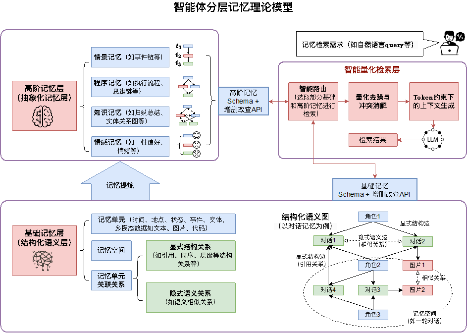
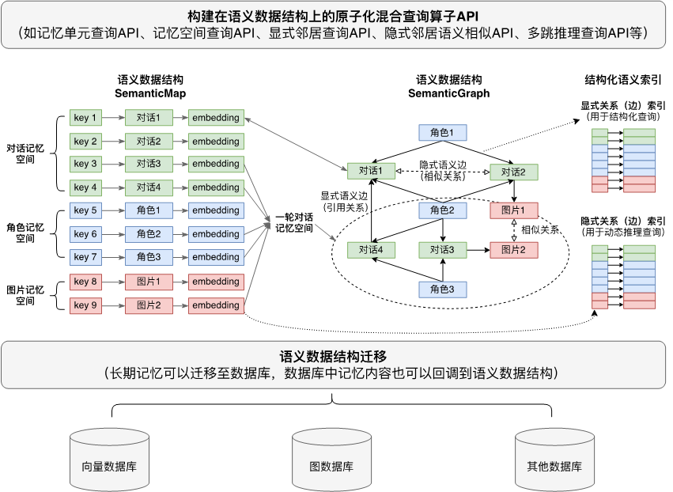
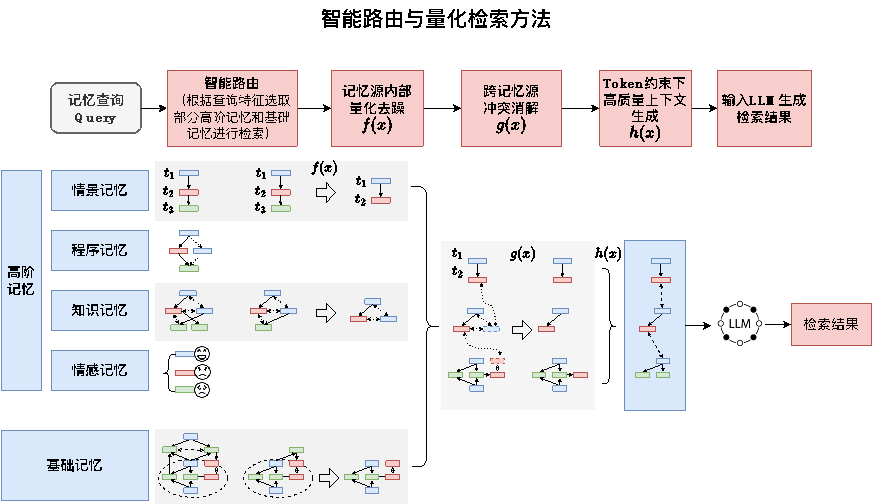

# Mandol

> Mandol: An In-Memory Layered Memory System for Long-Term Conversational Agents

[](LICENSE)
[](https://www.python.org/)
[](https://agentcombo.github.io/Mandol)
[](https://agentcombo.github.io/Mandol/docs)
[](https://arxiv.org/abs/260x.xxxxx)

[English](README.md) | [中文](README_CN.md)


---

## 📑 Table of Contents

<details>
<summary><b>Show/Hide</b></summary>

- [📖 What is Mandol?](#-what-is-mandol)
- [💡 Core Innovations](#-core-innovations)
- [✨ Key Features](#-key-features)
- [📊 Comparison with Mainstream Memory Systems](#-comparison-with-mainstream-memory-systems)
- [🏆 Application Cases](#-application-cases)
- [⚡ Quick Start](#-quick-start)
- [📚 Documentation & Community](#-documentation--community)
- [📄 Citation](#-citation)
- [📄 License](#-license)

</details>

---

## 📖 What is Mandol?

Mandol is an in-memory, layered memory system for long-term conversational agents, with efficient and precise retrieval capabilities. It achieves unified representation, efficient storage, and accurate retrieval of complex memory information, providing theoretical foundations and technical solutions for next-generation agent cognitive architectures.

The system is built on pure Python in-memory data structures, fusing key-value, vector, and graph indexing paradigms to provide a unified storage and hybrid retrieval interface with zero mandatory external dependencies. It can optionally integrate with external storage engines such as Milvus and Neo4j, while exposing a minimalist `add()` → `holistic_retrieve()` operational model. Its core innovation lies in transforming the traditional "passive recall–rerank" retrieval paradigm into a new proactive paradigm of "Query-Aware Routing → quantitative denoising → high-quality context generation."

**On mainstream conversational memory benchmarks, Mandol achieves SOTA-level comprehensive performance with lower token consumption:**

| **Dimension** | **Mem0** | **Zep** | **MemOS** | **EverMemOS** | **Mandol** |
|---|---|---|---|---|---|
| **Memory Organization** | Text vectors + metadata | Text vectors + temporal knowledge graph | Text vectors + graph/tree summaries | Text vectors + memory summaries | **Basic + high-level memories represented as a structured semantic graph** |
| **Storage** | VectorDB + metadata store | GraphDB + vector/full-text indexes | VectorDB + GraphDB | Multi-DB stack | **SemanticMap/Graph; DuckDB fallback** |
| **Retrieval** | Vector semantic retrieval + medatada filtering | Multi-step graph traversal + reranking | Vector retrieval + graph node matching | Multi-turn retrieval + query rewriting | **Hybrid recall + smart quantitative retrieval** |
| **Search Latency** | Medium | High | High | Very high | **low** |
| | | | | | |
| **LoCoMo Score** | 64.20 (1.0k Tokens) | 85.22 (1.4k Tokens) | 80.76 (2.5k Tokens) | 91.97 (2.7k Tokens) | **92.21 (1.9k Tokens)** |
| **LongMemEval Score** | 66.40 (1.1k Tokens) | 63.80 (1.6k Tokens) | 77.80 (1.4k Tokens) | 83.00 (2.8k Tokens) | **88.40 (2.3k Tokens)** |

> Mandol achieves a LoCoMo score of 92.21 with only 1.9k tokens — 1.4× the token efficiency of EverMemOS (2.7k) at comparable accuracy, and 3.7× that of Mem0 v2.0 (7.0k). On LongMemEval, it scores 88.40 with 2.3k tokens, improving 5.4 points over EverMemOS (2.8k / 83.00) while using 18% fewer tokens.

---

## 💡 Core Innovations

### (I) Theoretical Model Innovation: Layered Memory Model

We present a layered theoretical memory model that divides the memory system into a base memory layer, a high-level memory layer, and an intelligent query layer. A structured semantic graph uniformly represents complex, multi-relational memory information; implicit semantic edges are generated on demand to balance structural precision with semantic flexibility; and a bidirectional traceability mechanism links base and high-level memories. This model achieves unified representation of complex memory information and provides a theoretical foundation for subsequent storage and intelligent quantitative retrieval. Unlike vector representations that struggle to capture structural relationships, or knowledge graphs that insufficiently support multimodal and semantic similarity, this model establishes a unified theoretical framework spanning raw information storage, abstract knowledge extraction, and query scheduling.



### (II) Storage Architecture Innovation: Unified In-Memory Semantic Data Structure

We present a unified storage architecture based on in-memory semantic data structures. The coordinated design of SemanticMap and SemanticGraph achieves native fusion of key-value storage, vector indexing, and graph structures at the physical level, eliminating the fragmentation problem of multi-database architectures. Atomic hybrid retrieval operators encapsulate vector matching, graph traversal, and other operations as in-memory atomic operations, effectively reducing query latency and providing standardized, composable execution units for upper-layer intelligent quantitative queries. A collaborative "in-memory active state – database persistent state" architecture achieves an effective balance between performance and storage capacity.



### (III) Retrieval Mechanism Innovation: Query-Aware Routing and Quantitative Retrieval

We present a Query-Aware Routing and quantitative retrieval method that transforms the retrieval process from a passive "recall–rerank" pattern into a new paradigm of "Query-Aware Routing → quantitative denoising → high-quality context generation." Through innovative designs including Query-Aware Routing driven by query intent, quantitative denoising and conflict resolution, and token-constrained high-quality context generation, efficient and precise retrieval of complex multi-source memories is achieved within limited computation and token budgets.



---

## ✨ Key Features

### Lightweight Architecture

Pure Python implementation with a hexagonal architecture (ports-adapters pattern) at its core. `MemorySystem()` starts a complete memory system with zero mandatory external dependencies via its no-arg constructor. External engines such as FAISS, Milvus, and Neo4j can be switched via YAML configuration without modifying business code.

### Simple and Easy to Use

A three-step operational model covers the core workflow: `add()` writes memories → `build_high_level()` constructs high-level structures → `holistic_retrieve()` performs hybrid retrieval. `save()` / `load()` enable one-click persistence and restoration. In remote API mode, no local model download is required — just configure the API endpoint to get started quickly.

```python
from mandol import MemorySystem, MemoryUnit, Uid

system = MemorySystem.from_yaml_config("config.yaml")

system.add(MemoryUnit(
    uid=Uid("msg_001"),
    raw_data={"text_content": "Zhang San went to Beijing on a business trip today"},
    metadata={"timestamp": "2024-01-15T10:00:00"},
))

system.build_high_level(mode="auto")

hits = system.holistic_retrieve("Where did Zhang San go?", top_k=5)
for hit in hits:
    print(f"[{hit.final_score:.3f}] {hit.unit.raw_data['text_content']}")

system.save("./memory_snapshot")
```

### Unified Memory Representation

A single `MemoryUnit` abstraction uniformly encapsulates heterogeneous information such as text (`text_content`) and images (`image_path`), with automatic vectorization. The `MemorySpace` tree hierarchy flexibly organizes memories along dimensions such as BASE / ENTITY / EVENT / SUMMARY. `SemanticGraph` explicitly models inter-entity relationships and event causal chains as a directed graph, supporting multi-hop graph traversal retrieval.

### Layered Memory Structure

- **Base Memory Layer**: Raw data segments, retrievable immediately after `add()`
- **High-Level Memory Layer**: The system automatically performs session segmentation (LLM-driven), entity extraction and deduplication, event extraction and deduplication, entity relationship construction, event causal chain construction, multi-type summary generation (episodic / knowledge / emotional / procedural), and global insight extraction
- **Cross-Session Coreference Resolution**: Automatically merges the same entities and events across sessions, maintaining a consistent knowledge representation

### Multi-Backend Database Support

The hexagonal architecture fully decouples core logic from storage backends. The same API can switch between different underlying infrastructure: vector indexing (in-memory exact search → FAISS ANN adaptive switching), graph storage (in-memory → Neo4j), unit storage (in-memory → Milvus), Embedding / Reranker (local models → remote OpenAI-compatible API). All backend switches require only YAML configuration changes with zero business code modifications.

```yaml
# Example: switch from local models to remote API
embedder:
  use_remote: true
  base_url: "https://api.example.com/v1"

# Switch graph storage to Neo4j
graph_store:
  backend: neo4j
  uri: "bolt://localhost:7687"
```

---

## 📊 Comparison with Mainstream Memory Systems

The fundamental difference between Mandol and existing memory systems lies in the retrieval paradigm: traditional systems treat retrieval as a unidirectional pipeline (embedding recall → rerank → top-K), where retrieval is passive and lacks noise control. Mandol restructures this paradigm into a three-stage proactive retrieval pipeline — first dynamically routing to the most relevant memory sources based on query intent, then performing multi-level quantitative filtering and conflict resolution within and across sources, and finally generating high-information-density context under token constraints. This paradigm shift upgrades retrieval from passive "match–return" to proactive "understand–filter–summarize."

At the architectural level, Mandol adopts a hexagonal architecture (ports-adapters pattern), fully decoupling core retrieval logic from underlying storage engines and supporting flexible switching from pure in-memory mode to external engines such as FAISS, Milvus, and Neo4j (see "Multi-Backend Database Support" above).

> For detailed benchmark comparison data, see the performance table in the [What is Mandol?](#-what-is-mandol) section above.

---

## 🏆 Application Cases

### Long Conversational Memory Benchmark: LoCoMo

On the LoCoMo benchmark (10 long-term conversations × 200+ turns, covering single-hop / multi-hop / temporal / open-domain queries), Mandol achieves the highest **multi-hop reasoning** score (92.20) among all systems. This is attributed to `SemanticGraph`'s explicit entity-relation graph and BFS graph expansion mechanism, which traverses along relational edges across multiple hops to discover indirectly connected evidence.

> When queried "How did Manager Zhang's decision last year affect the Q2 project delay this year?", Mandol traces along the event causal chain `Decision A → Team restructuring → Resource transfer → Project B delay → Q2 delivery postponed`, completing a 4-hop trace. In contrast, pure vector retrieval can only return isolated fragments containing keywords like "Manager Zhang" or "Q2."

### Long Memory Evaluation Benchmark: LongMemEval

LongMemEval emphasizes memory retention and knowledge update capabilities in multi-session scenarios. Mandol achieves near-perfect scores on assistant-side memory (SS-Asst 98.21) and user-side memory (SS-User 98.57), with a knowledge update score of 89.74 — when two versions of the same fact exist (old and new), the system accurately adopts the new information and resolves the conflict, validating the effectiveness of cross-session coreference resolution and the "prefer new information" strategy.

### Intelligent Customer Service

In multi-turn customer service dialogues, when a user asks "What can I do about the price drop on the blue shirt I bought yesterday?", the system must simultaneously correlate memories across three dimensions: **temporal events** (when the price drop occurred), **product attributes** (blue shirt SKU), and **user information** (purchase records, membership tier). Mandol directly pinpoints the specific order and applicable price protection policy through multi-dimensional associative queries, generating an accurate response such as "Your order qualifies for our price protection policy. A refund of ¥35 can be issued," thereby improving first-contact resolution rates.

### Software Development

When a developer requests "Analyze the correlation between payment module anomalies and features shipped this week," the relevant information is scattered across PR discussions, issue comments, changelogs, and design documents. Mandol performs parallel retrieval across four memory spaces (BASE / ENTITY / EVENT / SUMMARY), while `SemanticGraph` automatically constructs a module–function–developer–version association graph. The retrieval results encompass code changes, discussion context, and temporal associations, shortening root cause analysis from days to minutes.

### Healthcare

When a doctor requests "Provide emergency examination support for a patient with fever after taking aspirin," critical information is dispersed across cross-department medical records, medication histories, and examination reports. Mandol retrieves through entity relationship graphs, traces event causal chains, and acquires knowledge summaries, converging cross-department, cross-temporal scattered information into structured decision-support context within milliseconds, reducing the risk of cross-department information omission.

---

## ⚡ Quick Start

### Installation

```bash
pip install mandol
```

Optional dependencies for additional backends:

```bash
pip install mandol[faiss]                 # FAISS vector index acceleration
pip install mandol[sentence-transformers] # Local Embedding/Reranker models
pip install mandol[openai]                # OpenAI API support
pip install mandol[milvus]                # Milvus vector database
pip install mandol[neo4j]                 # Neo4j graph database
pip install mandol[all]                   # Install all optional dependencies
```

> For complete installation guides, configuration details, and advanced usage, see the [online documentation](https://agentcombo.github.io/Mandol/docs).

### Configuration

Copy the environment variable template and fill in your API key:

```bash
cp .env.example .env
```

Or configure fully via a YAML configuration file:

```yaml
llm:
  model: "gpt-4o-mini"
  base_url: "https://api.openai.com/v1"
  api_key: "sk-..."

embedder:
  model: "Qwen/Qwen3-Embedding-4B"
  device: "cpu"
  use_remote: false

reranker:
  model: "Qwen/Qwen3-Reranker-4B"
  device: "cpu"
  use_remote: false

system:
  chunk_max_tokens: 512
  bfs_expansion_hops: 1
  max_context_units: 20
```

In remote API mode, no local model download (~8 GB) is needed — just set `use_remote` to `true` and configure the API endpoint to get started quickly.

### Three-Step Usage

```python
from mandol import MemorySystem, MemoryUnit, Uid

system = MemorySystem.from_yaml_config("config.yaml")

# 1. Write memories
system.add(MemoryUnit(
    uid=Uid("msg_001"),
    raw_data={"text_content": "Zhang San went to Beijing on a business trip today"},
    metadata={"timestamp": "2024-01-15T10:00:00"},
))

# 2. Build high-level memory structures
system.build_high_level(mode="auto")

# 3. Hybrid retrieval
hits = system.holistic_retrieve("Where did Zhang San go?", top_k=5)

system.save("./memory_snapshot")                        # Persist
system2 = MemorySystem.load("./memory_snapshot")        # Restore
```

> **Tip**: The system automatically detects session boundaries during `add()` and triggers high-level memory construction. After inserting a small amount of data, it is recommended to manually call `build_high_level()` to ensure high-level memories are available. For more configuration options and advanced usage, see the [online documentation](https://agentcombo.github.io/Mandol/docs).

---

## 📚 Documentation & Community

### Documentation

Complete API reference, architecture design, and best practice guides are built with Sphinx, covering three entry points for basic users, advanced users, and developers:

> 🔗 Online documentation: [https://agentcombo.github.io/Mandol/docs](https://agentcombo.github.io/Mandol/docs) (coming soon)

Build documentation locally:

```bash
cd docs && make html
```

### Contributing

We welcome community contributions! Please read [CONTRIBUTING.md](CONTRIBUTING.md) before submitting a PR to learn about development environment setup, code standards (Ruff, 100-char line length), testing requirements, and the PR process.

### Feedback & Discussion

- **Issues**: [GitHub Issues](https://github.com/AgentCombo/Mandol/issues) — Report bugs or request new features
- **Discussions**: [GitHub Discussions](https://github.com/AgentCombo/Mandol/discussions) — Usage questions, best practice discussions
- **Community**: [Discord](https://discord.gg/mandol) — Real-time chat and community support

---

## 📄 Citation

If this work is helpful to your research, please cite our paper:

```bibtex
@article{mandol2026,
  title   = {Mandol: An In-Memory Layered Memory System for Long-Term Conversational Agents},
  author  = {Yuhan Zhang, Zhiyuan Guo, Ziheng Zeng, Wei Wang, Wentao Wu, Lijie Xu},
  journal = {arXiv preprint arXiv:260x.xxxxx},
  year    = {2026}
}
```

> The paper is forthcoming. The full author list and arXiv link will be updated upon publication.

---

## 📄 License

Apache License 2.0 — See [LICENSE](LICENSE)
