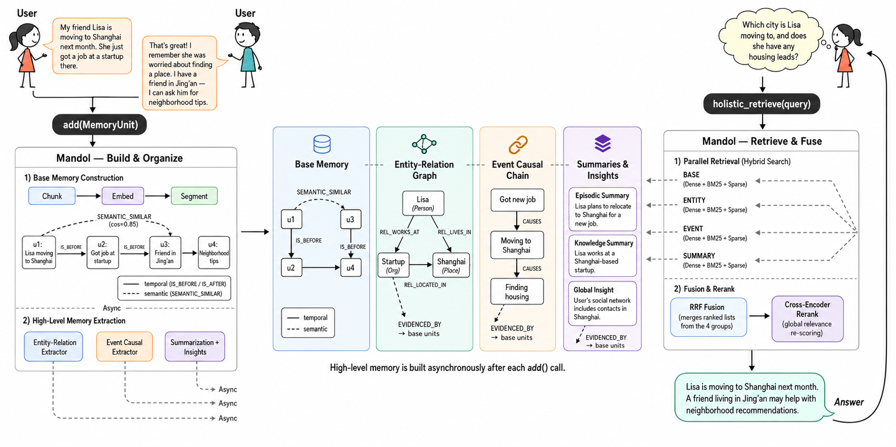
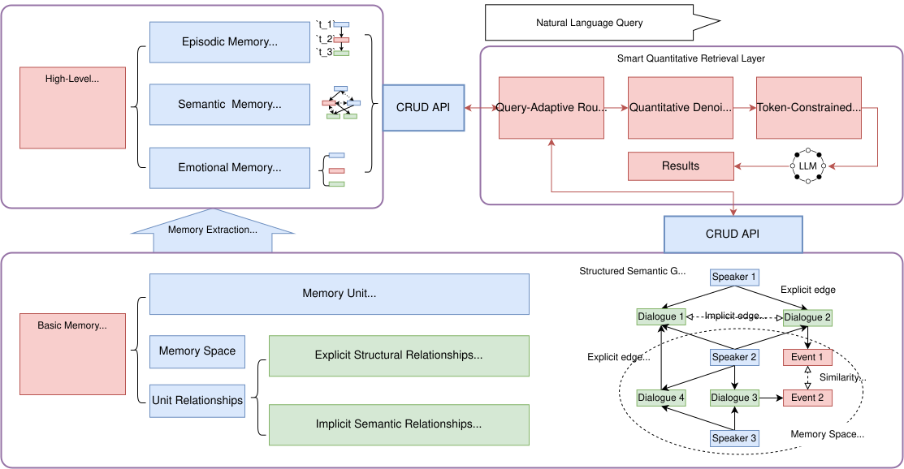
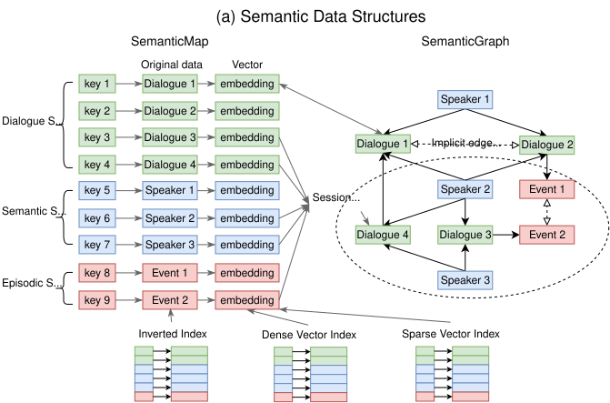
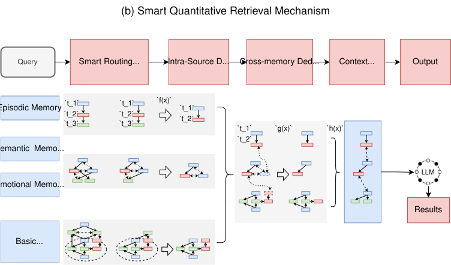

# Mandol

> Mandol：一种面向长对话的智能体内存记忆系统

[](LICENSE)
[](https://www.python.org/)
[](https://github.com/AgentCombo/Mandol/actions/workflows/ci.yml)
[](https://pypi.org/project/mandol/)
[](https://pypi.org/project/mandol/)
[](https://agentcombo.github.io/Mandol)
[](https://agentcombo.github.io/Mandol/docs)
[](https://arxiv.org/abs/2606.29778)

[English](README.md) | [中文](README_CN.md)

> [!IMPORTANT]
> `main` 分支现在承载 Mandol 当前公开的 Python 实现。迁移前原 `main`
> 分支中的历史实现保存在
> [`legacy/original`](https://github.com/AgentCombo/Mandol/tree/legacy/original)
> 分支中，仅供历史参考。
>
> 论文中报告的实验结果由冻结的
> [`paper-repro`](https://github.com/AgentCombo/Mandol/tree/paper-repro)
> artifact 生成。如需精确复现论文实验，请继续使用 `paper-repro` 分支。



---

## 📑 目录

<details>
<summary><b>展开/收起</b></summary>

- [📖 Mandol 是什么？](#-mandol-是什么)
- [💡 核心创新](#-核心创新)
- [✨ 关键特性](#-关键特性)
- [📊 与主流记忆系统对比](#-与主流记忆系统对比)
- [🏆 应用案例](#-应用案例)
- [🔬 论文复现](#-论文复现)
- [⚡ 快速开始](#-快速开始)
- [📚 文档与社区](#-文档与社区)
- [📄 引用](#-引用)
- [📄 许可](#-许可)

</details>

---

## 📖 Mandol 是什么？

Mandol 是一套以内存为核心、具备高效精确检索能力的智能体分层记忆系统，实现复杂记忆信息的统一表示、高效存储与高效精确检索，为下一代智能体认知架构提供理论支撑与技术方案。

系统采用 Python 实现的进程内检索与存储栈，通过 `SemanticMap` 与 `SemanticGraph` 融合记忆单元访问、稠密与稀疏索引、MemorySpace membership 和图拓扑。公开 API 提供基础语义检索、多方法融合检索和三塔检索，并可通过 RocksDB-backed tiered cache 自动管理冷 payload。其核心创新在于将传统「被动召回-排序」检索范式转变为「智能路由 → 量化去噪 → 高质量上下文生成」主动检索新范式。

**在主流对话记忆基准上，Mandol 以较低的 Token 消耗实现了 SOTA 级别的综合表现：**

| **维度** | **Mem0** | **Zep** | **MemOS** | **EverMemOS** | **Mandol** |
|---|---|---|---|---|---|
| **记忆组织与表示** | 文本向量 + 元数据 | 文本向量 + 时序知识图谱 | 文本向量 + 图/树摘要 | 文本向量 + 高层摘要 | **结构化语义图 + 抽象高阶记忆 + 层级化记忆** |
| **存储架构** | 单一关系数据库（含向量扩展） | 关系数据库 + 自定义图引擎 + 图数据库 | 图数据库 + 向量数据库组合 | 混合多组件数据库（文档、检索、向量、缓存） | **SemanticMap/Graph 与 RocksDB-backed 自动 payload 换页** |
| **检索与查询机制** | 向量语义检索 + 关键词过滤 | 多步图遍历拓扑搜索 + 重排序 | 向量检索 + 动态图节点召回 | 多路径路由 + LLM 多轮查询改写 | **内存多路并行召回 + 智能路由 + 量化去噪 + 上下文优化** |
| **I/O 开销与资源** | 中等：受限于传统数据库的行级更新与单路径索引 | 高：频繁的事实提取与跨服务通信导致系统延迟高 | 高：多数据库导致沉重的 I/O 开销 | 极高：极度碎片化的组件栈导致严重的跨存储网络与序列化开销 | **极低：核心算子均在进程内原生执行，完全消除跨存储网络与通信瓶颈** |
| | | | | | |
| **LoCoMo 评分** | 64.20 (1.0k Tokens) | 85.22 (1.4k Tokens) | 80.76 (2.5k Tokens) | 91.97 (2.7k Tokens) | **92.21 (1.9k Tokens)** |
| **LongMemEval 评分** | 66.40 (1.1k Tokens) | 63.80 (1.6k Tokens) | 77.80 (1.4k Tokens) | 83.00 (2.8k Tokens) | **88.40 (2.3k Tokens)** |

> Mandol 以 1.9k Token 达到 LoCoMo 92.21 分——Token 效率是同等精度系统 EverMemOS（2.7k）的 1.4 倍，是 Mem0 v2.0（7.0k）的 3.7 倍。LongMemEval 上以 2.3k Token 达到 88.40 分，较 EverMemOS（2.8k / 83.00）在 Token 减少 18% 的同时评分提升 5.4 个百分点。

---

## 💡 核心创新

### （一）理论模型创新：分层式理论记忆模型

提出分层式理论记忆模型，将记忆系统划分为基础记忆层、高阶记忆层和智能查询层。通过结构化语义图统一表征多模态、关联复杂的记忆信息，引入隐式语义边按需生成策略兼顾结构化精确性与语义灵活性，并建立基础与高阶记忆的双向可追溯机制。该模型实现了复杂记忆信息的统一表示，并为后续存储和智能量化检索提供了理论基础。相比现有向量表示难以刻画结构关系、知识图谱对多模态和语义相似支持不足的局限，该模型构建了从原始信息存储、抽象知识提炼到查询调度的统一理论框架。



### （二）存储架构创新：基于内存语义数据结构的统一存储架构

提出基于内存语义数据结构的统一存储架构，设计 SemanticMap 与 SemanticGraph 协同的内存语义数据结构，在物理层面实现键值存储、向量索引与图结构的原生融合，消除多库碎片化问题。该架构通过原子化混合检索算子将向量匹配、图遍历等操作统一封装为内存原子操作，有效降低查询延迟，为上层智能量化查询提供了标准化、可组合的执行单元；同时，采用「内存活跃态-数据库持久态」协同架构，实现性能与存储容量的有效平衡。



### （三）检索机制创新：智能路由与量化检索方法

提出一种智能路由与量化检索方法，将检索过程从被动「召回-排序」模式，转变为「智能路由-量化去噪-高质量上下文生成」新范式。通过查询意图驱动的智能路由、量化去噪和冲突消解、以及 Token 约束下的高质量上下文生成等创新设计，在有限的计算与 Token 预算下，实现对复杂多源记忆的高效精确检索。



---

## ✨ 关键特性

### 轻量级架构

当前实现以 `core` 中的 `SemanticMap` / `SemanticGraph` 为基础，`retrieval` 与 `triple_retrieval` 负责检索管线，`auto_builder` 负责高阶记忆构建，`memory_router` 与 `quantification` 负责路由和充分性判断，`storage` 负责 RocksDB-backed 分层换页。运行依赖和可选加速项以 `pyproject.toml` 为准。

### 简单易用

基础流程直接使用公开的 `MemoryUnit`、`SemanticMap` 和 `SemanticGraph` API：写入后即可进行语义检索，并通过 `save_graph()` / `load_graph()` 保存和恢复完整图快照。融合检索、高阶记忆构建和论文中的 router + quantification 工作流由对应模块显式提供，而不是在基础写入过程中隐式触发。

### 统一记忆表示

单一 `MemoryUnit` 抽象统一承载文本（`text_content`）与图像（`image_path`）等异构信息，自动完成向量化。`MemorySpace` 树形层级支持按 BASE / ENTITY / EVENT / SUMMARY 等维度灵活组织记忆。`SemanticGraph` 以有向图显式建模实体间关系与事件因果链，支持多跳图遍历检索。

### 层级化记忆结构

- **基础记忆层（Base）**：原始 `MemoryUnit` 通过 `add_unit()` / `batch_add_units()` 写入后即可检索
- **高阶记忆层（High-Level）**：`mandol.auto_builder` 通过显式编排构建层级摘要、情景事实和实体关系结构
- **跨会话处理**：构建器可执行会话分配、实体与事件提取及去重，并保留到基础记忆的可追溯关系

### 进程内检索与分层持久化

FAISS 稠密索引、BM25/SPLADE 稀疏索引、UID 映射、MemorySpace membership 和图拓扑常驻进程内。未调用 `connect_to_l2()` 时，`MemoryUnit` payload 正常驻留内存；调用后，RocksDB-backed tiered cache 会在达到高水位线时异步换出冷 payload，并在检索结果需要时 page in 回 resident cache。RocksDB 是当前实现唯一正式支持的 persistent payload backend。

---

## 📊 与主流记忆系统对比

Mandol 与现有记忆系统的本质区别在于检索范式：传统系统将检索视为单向流水线（Embedding 召回 → Rerank 排序 → Top-K），检索过程被动且缺乏对噪声的控制。Mandol 将这一范式重构为三阶段主动检索流水线——首先依据查询意图动态路由到最相关的记忆源，然后在各源内部及跨源之间进行多级量化过滤与冲突消解，最后在 Token 约束下生成高信息密度上下文。这一范式转变使检索从被动的「匹配-返回」升级为主动的「理解-筛选-归纳」。

在架构层面，Mandol 将检索索引与图拓扑保留在进程内，并可使用 RocksDB 自动管理冷 payload。当前公开实现不提供通用的存储后端切换契约。

> 详细的基准对比数据见上方「[Mandol 是什么？](#-mandol-是什么)」章节中的性能表格。

---

## 🏆 应用案例

### 长对话记忆基准 LoCoMo

在 LoCoMo 基准（10 段长对话 × 200+ 轮交互，覆盖单跳/多跳/时序/开放域查询）中，Mandol 在所有系统中取得最高的**多跳推理**评分（92.20 分）。这得益于 `SemanticGraph` 的显式实体关系图与 BFS 图扩展机制，能够沿关系边多跳遍历发现非直接关联的证据。

> 当查询「张经理去年的决策对今年 Q2 的项目延期有何影响」时，Mandol 沿事件因果链 `决策A → 团队调整 → 资源转移 → 项目B延期 → Q2交付推迟` 完成 4 跳追溯，而纯向量检索仅能返回包含「张经理」「Q2」等关键词的孤立片段。

### 长记忆评估基准 LongMemEval

LongMemEval 侧重多会话场景下的记忆保持与知识更新能力。Mandol 在助手侧记忆（SS-Asst 98.21）和用户侧记忆（SS-User 98.57）两个子项上接近满分，知识更新评分 89.74——当同一事实存在新旧两个版本时，系统准确采纳新信息并消解冲突，验证了跨会话共指消解与「优先采纳新信息」策略的有效性。

### 智能客服

多轮客服对话中，当用户询问「昨天买的蓝色衬衫降价了怎么办」，系统需同时关联**时序事件**（降价发生时间）、**商品属性**（蓝色衬衫 SKU）、**用户信息**（购买记录、会员等级）三个维度的记忆。Mandol 通过多维关联查询直接锁定具体订单和适用价保策略，生成包含「您的订单符合价保规则，可退差价 ¥35」的准确回复，提升一次解决率。

### 软件开发

当开发者请求「分析支付模块异常与近一周上线功能的关联」，信息分散在 PR 讨论、Issue 评论、变更日志和设计文档中。Mandol 跨 BASE/ENTITY/EVENT/SUMMARY 四组空间并行检索，`SemanticGraph` 自动构建模块-函数-开发者-版本关联图，检索结果涵盖代码变更、讨论上下文和时序关联，将根因分析从天级缩短至分钟级。

### 医疗

医生请求「对服用阿司匹林后发热的患者提供紧急检查支持」时，关键信息分散在跨科室病历、用药记录和检查报告中。Mandol 通过实体关系图检索、事件因果链追溯和知识摘要获取，在毫秒级内将跨科室、跨时间维度的分散信息汇聚为结构化决策支持上下文，降低跨科室信息遗漏风险。

---

## 🔬 论文复现

论文中报告的 LoCoMo 和 LongMemEval 实验结果基于冻结的
[`paper-repro`](https://github.com/AgentCombo/Mandol/tree/paper-repro)
版本生成。若需要忠实复现论文实验，请直接克隆该分支：

```bash
git clone --branch paper-repro --single-branch https://github.com/AgentCombo/Mandol.git
cd Mandol
```

请按照 `paper-repro` 分支中的基准专项说明运行：

- [LoCoMo 论文复现](https://github.com/AgentCombo/Mandol/blob/paper-repro/benchmark_locomo/REPRODUCE.md)
- [LongMemEval 论文复现](https://github.com/AgentCombo/Mandol/blob/paper-repro/benchmark_longmemeval/REPRODUCE.md)

`main` 分支承载当前持续维护的公开实现。其中的 [`benchmark_self_host/`](benchmark_self_host/) 用于当前 self-host 集成验证和工作流开发，但不是生成论文表格时使用的冻结入口。[`legacy/original`](https://github.com/AgentCombo/Mandol/tree/legacy/original) 仅保存迁移前的历史实现，不属于当前 API 或推荐复现入口。数据集、实验配置和中间产物的获取方式，请以 `paper-repro` 分支中的对应文档为准。

## ⚡ 快速开始

### 安装

Mandol `0.1.0a2` 要求 Python `>=3.12,<3.13`。

#### 已发布包

当前预发布版本可从稳定的 [PyPI 项目主页](https://pypi.org/project/mandol/) 安装：

```bash
python -m pip install "mandol==0.1.0a2"
```

严格复现论文时，应使用 `paper-repro` 源码及其基准专项说明，而不是仅依赖安装包。

#### 源码环境

基础源码环境：

```bash
uv sync
```

日常开发和文档环境：

```bash
uv sync --extra dev --extra docs --group spacy-model
```

完整论文复现和性能环境请在 `paper-repro` 工作树中安装：

```bash
uv sync --extra dev --extra cuda --group spacy-model
```

如果本机不支持 CUDA 或 flash-attention，可以去掉 `--extra cuda`：

```bash
uv sync --extra dev --group spacy-model
```

`cuda` extra 针对论文 artifact 固定到 Linux x86_64 / Python 3.12 /
Torch 2.8 / CUDA 12 的 flash-attention wheel。如果该 wheel 与本机环境不匹配，
请去掉 `--extra cuda`，或手动安装兼容版本的 `flash-attn`。

验证本地包版本和构建发行归档：

```bash
uv run python -c "import mandol; print(mandol.__version__)"
uv build
```

> 如需严格复现论文实验结果，请使用 [`paper-repro`](https://github.com/AgentCombo/Mandol/tree/paper-repro) 分支。
> 完整的安装指南、配置说明和进阶用法请参阅 [在线文档](https://agentcombo.github.io/Mandol/docs)。

### 配置

复制环境变量模板，并只填写当前工作流需要的 provider key：

```bash
cp env.template .env
```

`env.template` 列出了 OpenAI-compatible provider key、base URL、Embedding /
Reranker 端点和可选运行参数。`CLOSEAI_*` 是论文 artifact 使用的
OpenAI-compatible provider alias；若不使用该网关，可以配置
`OPENAI_API_KEY`，或在 provider 配置中将模型 alias 映射到自己的服务。
模型和索引选择通过当前组件构造参数及 benchmark 配置对象传入；仓库不提供用于构造
完整系统的统一 YAML facade。

### 核心用法

```python
from mandol import MemoryUnit, SemanticGraph, SemanticMap

semantic_map = SemanticMap(
    embedding_model_name="all-MiniLM-L6-v2",
    use_flash_attention=False,
)
graph = SemanticGraph(semantic_map_instance=semantic_map)

graph.add_unit(
    MemoryUnit(
        uid="msg_001",
        raw_data={"text_content": "张三今天去了北京。"},
        metadata={"timestamp": "2026-06-21T09:00:00"},
    ),
    space_names=["demo"],
    generate_sparse_embedding=False,
)

results = graph.search_similarity_in_graph(
    query_text="张三去了哪里？",
    top_k=3,
    ms_names=["demo"],
    return_score=True,
)

for unit, score in results:
    print(score, unit.uid, unit.text_cached)

graph.save_graph("./memory_snapshot", build_sparse_vectors=False)
restored = SemanticGraph.load_graph(
    "./memory_snapshot",
    embedding_model_name="all-MiniLM-L6-v2",
    use_flash_attention=False,
)
```

创建 `SemanticMap` 会加载所选 Embedding 模型，首次使用时可能需要下载。
高阶记忆构建由 `mandol.auto_builder` 单独提供。

对于更大的记忆集合，可启用 RocksDB-backed 自动 payload 换页：

```python
graph.connect_to_l2(
    "./l2_database",
    max_capacity=100_000,
    high_watermark=0.85,
    low_watermark=0.70,
)
```

如果不调用 `connect_to_l2()`，payload 会正常驻留内存。启用后，候选选择和换出任务调度发生在 add 路径中，RocksDB 写入及 resident cache 删除可能异步完成；冷结果的 payload materialization 发生在需要该 payload 的 search 调用内。

---

## 📚 文档与社区

### 文档

当前维护的 API 参考、架构说明和使用指南通过 Sphinx 构建：

> 🔗 在线文档：[https://agentcombo.github.io/Mandol/docs](https://agentcombo.github.io/Mandol/docs)

本地构建文档：

```bash
make docs
```

### 参与贡献

我们欢迎社区贡献！提交 PR 前请阅读 [CONTRIBUTING.md](CONTRIBUTING.md)，了解开发环境搭建、代码规范（Ruff，行长 100 字符）、测试要求和 PR 流程。

### 反馈与讨论

- **Issue**：[GitHub Issues](https://github.com/AgentCombo/Mandol/issues) — 报告 Bug 或请求新功能
- **讨论**：[GitHub Discussions](https://github.com/AgentCombo/Mandol/discussions) — 使用问题、最佳实践交流
- **社区**：扫描下方二维码加入 Mandol 微信用户群


---

## 📄 引用

如果本工作对您的研究有帮助，请引用我们的论文：

```bibtex
@misc{zhang2026mandol,
  title={Mandol: An Agglomerative Agent Memory System for Long-Term Conversations},
  author={Yuhan Zhang and Zhiyuan Guo and Ziheng Zeng and Wei Wang and Wentao Wu and Lijie Xu},
  year={2026},
  eprint={2606.29778},
  archivePrefix={arXiv},
  primaryClass={cs.DB},
  doi={10.48550/arXiv.2606.29778},
  url={https://arxiv.org/abs/2606.29778}
}
```

---

## 📄 许可

Apache License 2.0 - 详见 [LICENSE](LICENSE)
